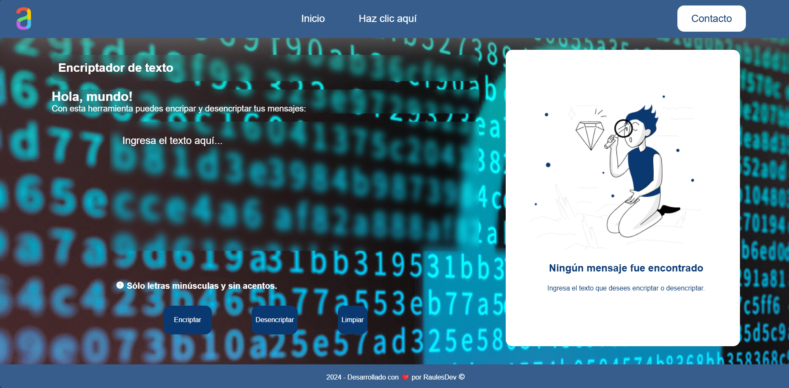

# Encriptador de Texto 🔒
¡Bienvenido a Encriptador de Texto, una herramienta simple pero poderosa basada en JavaScript que encripta y desencripta mensajes con un algoritmo único y personalizado! Esta herramienta está diseñada para quienes desean jugar con el texto de manera divertida y creativa. Te dejo un screenshote del proyecto:

### Características 🚀
Encriptación personalizada: Cada vocal en el texto se sustituye con una cadena específica:

*e se convierte en enter
*i se convierte en imes
*a se convierte en ai
*o se convierte en ober
*u se convierte en ufat
Desencriptación: Revierte fácilmente los mensajes encriptados a su forma original.

### Validación de entrada:

Solo acepta letras en minúsculas.
No se permiten acentos ni caracteres especiales.
Interfaz interactiva: Los botones se habilitan/deshabilitan según el contexto, proporcionando una experiencia de usuario fluida e intuitiva.

Copiar al portapapeles: Copia rápidamente el texto encriptado o desencriptado con un solo clic.

### Comenzando 🛠️
Sigue estas instrucciones para obtener una copia del proyecto y ejecutarlo en tu máquina local.

### Requisitos previos
Asegúrate de tener lo siguiente instalado en tu sistema:

Un navegador web moderno
Git (opcional, para clonar el repositorio)
Instalación
Clona el repositorio:
bash
Copy code
git clone https://github.com/raules-dev/Encriptador-de-texto.git
Abre el archivo index.html en tu navegador para comenzar a usar el Encriptador.
Uso
Ingresa tu texto: Escribe tu mensaje en el campo de entrada. Recuerda, la entrada debe estar en minúsculas, sin acentos ni caracteres especiales.
Encriptar: Haz clic en el botón "Encriptar" para ver la magia.
Desencriptar: Pega el mensaje encriptado y haz clic en "Desencriptar" para obtener el texto original.
Copiar: Usa el botón "Copiar" para copiar fácilmente el resultado en tu portapapeles.
Contribuciones 🤝
¡Las contribuciones son bienvenidas! Ya sea reportando un error, sugiriendo una función, o incluso mejorando la documentación, siéntete libre de hacer un fork de este proyecto y enviar una solicitud de cambios (pull request).

### Agradecimientos 🙏!
*Gracias a Alura Latam por los cursos con los que aprendí cómo crear este proyecto. 
*Un saludo a todos aquellos compañeros de Alura Latam cuyo código fue usado o referenciado. 
*Un agradecimiento especial a los desarrolladores y a la comunidad de código abierto por hacer posibles proyectos como este.!

